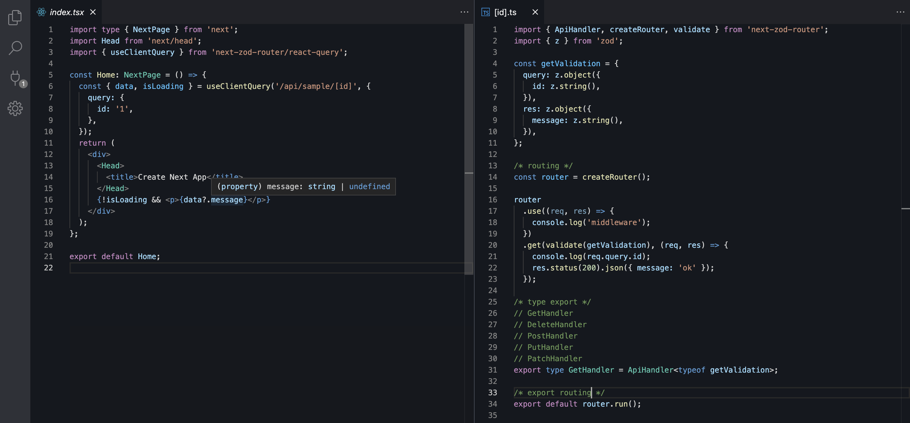

# next-typed-connect

A library for creating type-safe APIs in next.js.

## Features

- Type-safe API routing
- Type-safe API call
- error handling
- Type definition file generation
- Middleware support

## Screenshots




## Usage

### Installation


```bash
## npm
npm install next-typed-connect

## yarn
yarn add next-typed-connect
```

### Server-side

1. Use zod to define the types for body, query, and res.
2. Create routing handling with createRouter.
3. Assign types to the created routing handling with validate.
4. Export the types as GetHandler and PostHandler.

```ts
// pages/api/sample.ts
import { ApiHandler, createRouter, validate } from "next-typed-connect";
import { z } from "zod";

/* Schema definition using zod */
const postValidation = {
  body: z.object({
    foo: z.string(),
  }),
  query: z.object({
    bar: z.string().optional(),
  }),
  res: z.object({
    message: z.string(),
  }),
}

const getValidation = {
  query: z.object({
    bar: z.string().optional(),
  }),
  res: z.object({
    message: z.string(),
  }),
}    

/* Routing */
const router = createRouter()

router
  .use((req, res) => {
    console.log("middleware");
  })
  .post(
    validate(postValidation),
    (req, res) => {
      req.body.foo;
      req.query.bar;
      res.status(200).json({ message: "ok" });
    })
  .get(
    validate(getValidation),
    (req, res) => {
      req.query.bar;
      res.status(200).json({ message: "ok" });
    })

/* Type export */
// the export type name should be as follows
// so that the type definition file can be generated correctly via the command.
export type PostHandler = ApiHandler<typeof postValidation>
export type GetHandler = ApiHandler<typeof getValidation>

/* Routing handling export */
export default router.run()
```

### Error handling


#### throw error

```ts
// pages/api/sample.ts
router
  .post(
    validate(postValidation),
    (req, res) => {
      const session = getSession(req)
      if (!session) {
        throw createError(401, "Unauthorized")
      }
      res.status(200).json({ message: "ok" });
    })
```

#### custom error handling

```ts
// pages/api/sample.ts

router
  .onError((err, req, res) => {
    // custom error handling
    res.status(err.statusCode).json({ message: err.message });
  })
```

### Type generation


```bash
## npm
npx next-typed-connect

## yarn
yarn next-typed-connect
```

Adding a script to your package.json is convenient.

```json
{
  "scripts": {
    "apigen": "next-typed-connect"
  }
}
```

```bash
npm run apigen
```

### Client-side

```ts
import { postApiData, getApiData } from "next-typed-connect";

// Type-safe API call
const { data, error } = await postApiData("/api/sample", {
  query: {
    bar: "baz",
  },
  requestInit: {
    body: {
      foo: "bar",
    },
  }
})
```

## Command options

The default pages directory is `pages`, so if you want to change it, you can use the `--pagesDir` option.

```bash
next-typed-connect --pagesDir=src/pages
```

| Option | Description | Default value |
| --- | --- | --- |
| --pagesDir | Pages directory | pages |
| --baseDir | Project directory | . |
| --distDir | Type definition file output destination	 | node_modules/.next-typed-connect |
| --moduleNameSpace | Type definition file module name | .next-typed-connect |

## Tips

If you want to add session property to Request type, you can use the following code.

```ts
// global.d.ts
import { IncomingMessage } from "http";

declare module 'next' {
  export interface NextApiRequest extends IncomingMessage {
    session: Session
  }
}
```